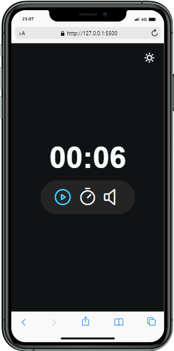
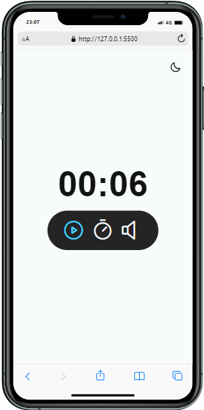

<h1 align="center">Focus Timer - contador
</h1>

## 🚀 Tecnologias

Esse projeto foi desenvolvido com as seguintes tecnologias:

- HTML
- CSS
- JavaScript

## 💻 Projeto

um contado de layout simple mas de logica avançada

## 🎓 Aprendizado

- audio com js
- função setTimeout()
- setAttribute('contenteditable',true) para editar campo
- função oninput()
- html:not() no css
- dataset / data-
- phosphor icons para icones
- acessibilidade para screen reader

## ℹ️ sobre

Esse projeto foi feito apartir do aprendizado do curso Explorer da rocketseat

## imagens do projeto

    

        
dark mode

    
    

    

        
dark mode

    
    

## imagens do projeto em display menores

    

        
dark mode

        
    

    

        
dark mode

    
    

    
   

